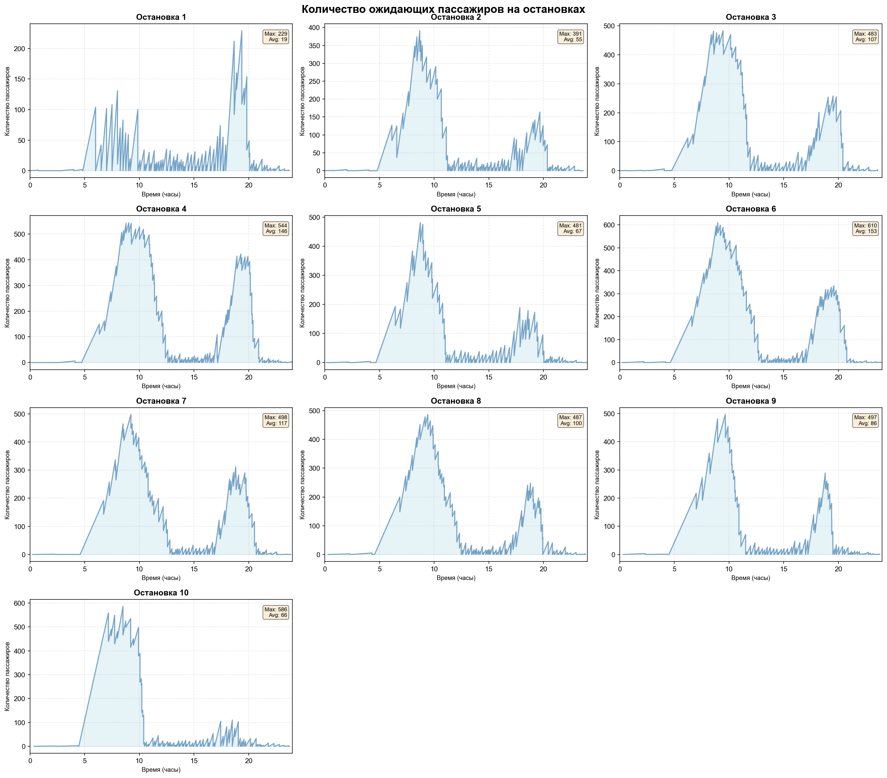
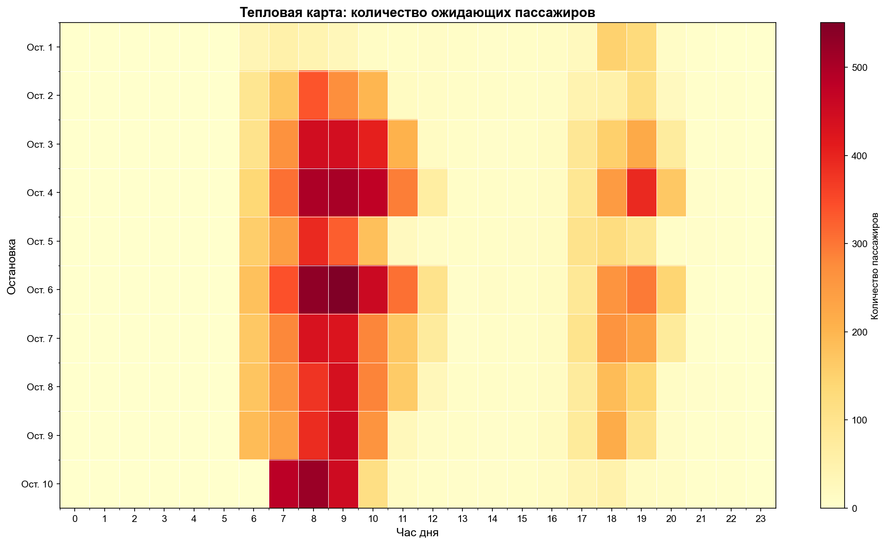
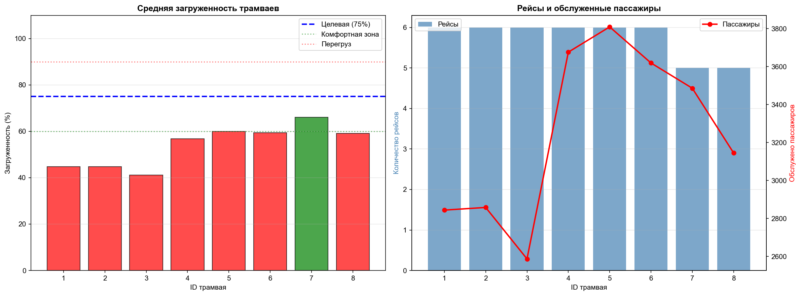
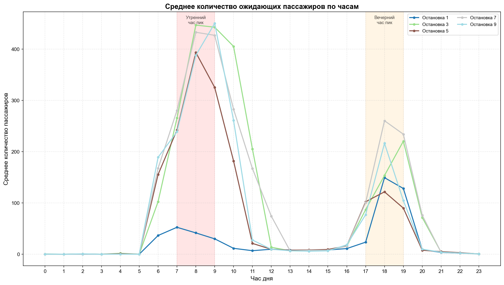

## СОДЕРЖАНИЕ

1. [Общее описание системы](#section1)
2. [Архитектура проекта](#section2)
3. [Логика работы модели](#section3)
4. [Модули и их функции](#section4)
5. [Формат входных данных](#section5)
6. [Результаты работы](#section6)
7. [Запуск и использование](#section7)
8. [Примеры работы модели](#section8)


***
<a name="section1"></a>
## 1. ОБЩЕЕ ОПИСАНИЕ СИСТЕМЫ

Разработанная система представляет собой дискретно-событийную имитационную модель для анализа работы трамвайного маршрута. Модель построена на базе библиотеки SimPy, которая позволяет эффективно моделировать параллельные процессы с общими ресурсами.

### Основные задачи модели:

- Моделирование движения трамваев по заданному маршруту с учётом графика движения
- Симуляция пассажиропотока с учётом времени суток и популярности остановок
- Расчёт ключевых показателей эффективности (загруженность, время ожидания, пропускная способность)
- Визуализация результатов для анализа узких мест системы

Модель позволяет тестировать различные конфигурации расписания и парка транспортных средств без проведения дорогостоящих натурных экспериментов.

***
<a name="section2"></a>
## 2. АРХИТЕКТУРА ПРОЕКТА

### Структура файлов:

```
project/
├── tram_simulation.py       # Ядро симуляции
├── visualization.py          # Построение графиков
├── logger.py                 # Система логирования
├── generate_config.py        # Генератор тестовых конфигураций
├── configs/                  # Конфигурационные файлы
└── outputs/                  # Результаты запусков
    └── run_YYYY-MM-DD_HH-MM-SS/
        ├── logs/             # CSV-файлы с детализацией
        └── plots/            # Графики результатов
```


### Принцип работы:

Система реализует агентно-ориентированный подход, где каждый трамвай является независимым агентом с собственным жизненным циклом. Процессы взаимодействуют через общие ресурсы (остановки) и координируются центральным диспетчером (генератор трамваев).

***
<a name="section3"></a>
## 3. ЛОГИКА РАБОТЫ МОДЕЛИ

### 3.1 Инициализация системы

При запуске модели происходит:

1. Загрузка конфигурации из JSON-файла (параметры маршрута, интенсивности, расписание)
2. Создание остановок как точек с накапливающимися очередями
3. Формирование парка трамваев фиксированного размера
4. Помещение всех трамваев в пул доступных ресурсов

Используется паттерн "пул объектов" для эффективного переиспользования трамваев. Используется принцип FIFO - вернувшийся в парк трамвай встаёт в конец очереди на повторный выход.

### 3.2 Генерация пассажиров

Количество прибывающих пассажиров рассчитывается на основе:

- **Базовой интенсивности остановки** — зависит от положения на маршруте (центральные остановки загружены сильнее)
- **Коэффициента времени суток** — учитывает часы пик и ночное время
- **Времени с последнего трамвая** — чем дольше не было трамвая, тем больше накопилось пассажиров

Для имитации случайности применяется нормальное распределение как аппроксимация распределения Пуассона для больших интенсивностей.

**Формула:**

```
новых_пассажиров = N(μ=интенсивность×Δt, σ=√μ)
где N — нормальное распределение
```


### 3.3 Жизненный цикл трамвая

Каждый трамвай проходит следующий цикл:

1. **Ожидание** — находится в пуле до момента выхода на маршрут
2. **Выход на маршрут** — запускается согласно расписанию (bus_interval)
3. **Движение "туда"** — последовательный проезд всех остановок (1→N)
4. **Разворот** — пауза на конечной остановке
5. **Движение "обратно"** — проезд остановок в обратном порядке (N→1)
6. **Возврат на базу** — трамвай освобождается и возвращается в пул
7. **Повторное использование** — может быть запущен снова при необходимости

Один полный цикл (туда+обратно) считается одним рейсом.

### 3.4 Логика остановки

При прибытии трамвая на остановку:

1. **Высадка пассажиров:**
    - Базовый процент высадки (20%)
    - Удвоение на популярной остановке (центр города)
    - Увеличение по мере приближения к концу маршрута
    - Полная высадка на конечной остановке
2. **Генерация новых пассажиров:**
    - Расчёт количества на основе интенсивности и времени ожидания
3. **Посадка:**
    - Садится min(ожидающих, свободных_мест)
    - Оставшиеся продолжают ждать следующего трамвая
4. **Учёт времени:**
    - Фиксируется время ожидания для расчёта средних показателей
    - Обновляется время последнего обслуживания остановки

### 3.5 Расчёт времени движения

Время проезда между остановками зависит от:

- Расстояния (из конфигурации)
- Базовой скорости потока (flow_speed)
- Загруженности дорог в текущий час (road_loads)
- Случайного отклонения ±5% (имитация светофоров, маневрирования)

**Формула:**

```
скорость = базовая_скорость × (1 - загруженность) × случайность
время = расстояние / скорость + время_разгона
```

В часы пик (загруженность 0.9) скорость падает до 10% от номинальной, что реалистично отражает пробки.

***
<a name="section4"></a>
## 4. МОДУЛИ И ИХ ФУНКЦИИ

### 4.1 tram_simulation.py

**Основные классы:**

- `Stop` — модель остановки с очередью пассажиров
    - `get_new_passengers()` — генерация прибывших пассажиров
    - `record_waiting()` — запись состояния для построения графиков
- `Tram` — модель трамвая
    - `board_passengers()` — посадка с учётом вместимости
    - `alight_passengers()` — высадка по сложной логике
    - `log_stop_event()` — детальное логирование для CSV
- `TramSimulation` — управляющий класс
    - `tram_generator()` — процесс выпуска трамваев по расписанию
    - `tram_process()` — жизненный цикл одного трамвая
    - `arrive_at_stop()` — обработка прибытия на остановку
    - `calculate_travel_time()` — расчёт времени в пути


### 4.2 visualization.py

Модуль построения аналитических графиков:

- `plot_waiting_passengers()` — динамика очередей на каждой остановке
- `plot_waiting_by_hour()` — среднее количество ожидающих по часам
- `plot_heatmap()` — тепловая карта загруженности остановок
- `plot_utilization()` — загруженность трамваев
- `plot_tram_utilization_by_hour()` — почасовая загруженность парка

Графики сохраняются в PNG с разрешением 150 DPI.

### 4.3 logger.py

Система детального логирования:

- Создаёт отдельный CSV для каждого трамвая с полной историей остановок
- Формирует сводную таблицу по всем трамваям
- Записывает: время, остановку, направление, высадку, посадку, загруженность


### 4.4 generate_config.py

Генератор тестовых конфигураций:

- `generate_intensity_data()` — интенсивность с учётом позиции остановки и времени суток
- `generate_bus_intervals()` — расписание с частыми интервалами в часы пик
- `generate_road_loads()` — загруженность дорог по шаблону будних дней
- `generate_distances()` — случайные расстояния между остановками (400-800м)

Функции позволяют быстро создавать тестовые сценарии без ручного заполнения JSON.

***
<a name="section5"></a>
## 5. ФОРМАТ ВХОДНЫХ ДАННЫХ

### JSON-конфигурация (пример: configs/tram_config.json)

```json
{
  "stop_number": 10,
  "distance": [[1,0], [2,500], [3,600], ...],
  "intensity": [
    [1,0,15], [1,1,15], [1,7,225], [1,8,270], ...,
    [2,0,13], [2,1,13], ...
  ],
  "bus_interval": [[0,90], [6,18], [8,8], [17,8], [23,90]],
  "road_loads": [[0,0.1], [8,0.9], [17,0.9], ...],
  "flow_speed": 40,
  "peak_stop": 5,
  "tram_capacity": 120,
  "simulation_hours": 24,
  "acceleration_time": 0.5,
  "stop_time": 1.0
}
```

**Описание полей:**

- `stop_number` — количество остановок на маршруте
- `distance` — [[номер_остановки, метров_от_предыдущей], ...]
- `intensity` — [[остановка, час, пассажиров_в_час], ...]
- `bus_interval` — [[час_начала, минут_между_трамваями], ...]
- `road_loads` — [[час, коэффициент_загруженности_0-1], ...]
- `flow_speed` — базовая скорость движения (км/ч)
- `peak_stop` — номер самой популярной остановки
- `tram_capacity` — вместимость одного трамвая
- `simulation_hours` — длительность моделирования

***
<a name="section6"></a>
## 6. РЕЗУЛЬТАТЫ РАБОТЫ

### 6.1 Консольный вывод

- Лог событий в реальном времени (выход/возврат трамваев)
- Итоговая статистика по трамваям (рейсы, обслужено, средняя загрузка)
- Статистика по остановкам (обслужено, среднее ожидание, очередь)


### 6.2 CSV-файлы (outputs/run_*/logs/)

Для каждого трамвая создаётся файл `tram_XXX.csv`:


| Время (мин) | Час | Остановка | Направление | Ожидало | Высадка | Посадка | Загруженность (%) |
| :-- | :-- | :-- | :-- | :-- | :-- | :-- | :-- |
| 15.3 | 0 | 2 | Туда | 8 | 0 | 8 | 12.5 |

Сводная таблица `trams_summary.csv` содержит агрегированные показатели.

### 6.3 Графики (outputs/run_*/plots/)

1. **waiting_passengers.png** — графики (по остановкам) динамики очередей
2. **waiting_by_hour.png** — среднее количество ожидающих по часам
3. **waiting_heatmap.png** — матрица (остановки × часы) с цветовой индикацией
4. **tram_utilization.png** — загруженность каждого трамвая + количество рейсов
5. **tram_utilization_by_hour.png** — почасовая динамика загруженности парка

***
<a name="section7"></a>
## 7. ЗАПУСК И ИСПОЛЬЗОВАНИЕ {\#использование}

### 7.1 Установка зависимостей

```bash
pip install -r requirements.txt
```


### 7.2 Генерация конфигураций

```bash
python generate_config.py
```

Создаст в папке `configs/` три тестовых конфигурации.

### 7.3 Запуск симуляции

**Базовый запуск:**

```bash
python tram_simulation.py
```

**С указанием конфигурации:**

```bash
python tram_simulation.py --config tram_config_large.json
```

**Без графиков (быстрый режим):**

```bash
python tram_simulation.py --no-plots
```

**Без детальных логов:**

```bash
python tram_simulation.py --no-logs
```


### 7.4 Анализ результатов

Результаты сохраняются в `outputs/run_ГГГГ-ММ-ДД_ЧЧ-ММ-СС/`. Каждый запуск создаёт отдельную папку с timestamp, что позволяет сравнивать различные конфигурации.

***
<a name="section8"></a>
## 8. ПРИМЕР ВЫВОДА

### 8.1 Консольный вывод
```
Результаты будут сохранены в: outputs\run_2025-10-22_11-51-38/

============================================================
Запуск симуляции движения трамваев
Конфигурация: tram_config.json
Длительность: 24 часов
Количество остановок: 10
Вместимость трамвая: 120 чел.
============================================================

Создан парк из 8 трамваев
[0.0] Трамвай #1 выехал на маршрут (рейс #1)
[48.2] Трамвай #1 вернулся на базу. Рейс #1, обслужено 10 пас. (всего)
[120.0] Трамвай #2 выехал на маршрут (рейс #1)
[168.8] Трамвай #2 вернулся на базу. Рейс #1, обслужено 14 пас. (всего)
[240.0] Трамвай #3 выехал на маршрут (рейс #1)
[290.8] Трамвай #3 вернулся на базу. Рейс #1, обслужено 33 пас. (всего)
[360.0] Трамвай #4 выехал на маршрут (рейс #1)
[390.0] Трамвай #5 выехал на маршрут (рейс #1)
[420.0] Трамвай #6 выехал на маршрут (рейс #1)
[450.0] Трамвай #7 выехал на маршрут (рейс #1)
[480.0] Трамвай #8 выехал на маршрут (рейс #1)
[495.0] Трамвай #1 выехал на маршрут (рейс #2)
[510.0] Трамвай #2 выехал на маршрут (рейс #2)
[525.0] Трамвай #3 выехал на маршрут (рейс #2)
[548.8] Трамвай #4 вернулся на базу. Рейс #1, обслужено 1059 пас. (всего)
[548.8] Трамвай #4 выехал на маршрут (рейс #2)
[603.7] Трамвай #5 вернулся на базу. Рейс #1, обслужено 1091 пас. (всего)
[603.7] Трамвай #5 выехал на маршрут (рейс #2)
[635.0] Трамвай #6 вернулся на базу. Рейс #1, обслужено 1039 пас. (всего)
[635.0] Трамвай #6 выехал на маршрут (рейс #2)
[662.8] Трамвай #7 вернулся на базу. Рейс #1, обслужено 1039 пас. (всего)
[662.8] Трамвай #7 выехал на маршрут (рейс #2)
[690.9] Трамвай #8 вернулся на базу. Рейс #1, обслужено 1045 пас. (всего)
[690.9] Трамвай #8 выехал на маршрут (рейс #2)
[697.5] Трамвай #1 вернулся на базу. Рейс #2, обслужено 1011 пас. (всего)
[700.3] Трамвай #2 вернулся на базу. Рейс #2, обслужено 950 пас. (всего)
[710.9] Трамвай #1 выехал на маршрут (рейс #3)
[712.4] Трамвай #3 вернулся на базу. Рейс #2, обслужено 982 пас. (всего)
[722.6] Трамвай #4 вернулся на базу. Рейс #2, обслужено 1904 пас. (всего)
[730.9] Трамвай #2 выехал на маршрут (рейс #3)
[750.9] Трамвай #3 выехал на маршрут (рейс #3)
[758.8] Трамвай #5 вернулся на базу. Рейс #2, обслужено 1917 пас. (всего)
[770.9] Трамвай #4 выехал на маршрут (рейс #3)
[776.3] Трамвай #6 вернулся на базу. Рейс #2, обслужено 1760 пас. (всего)
[790.9] Трамвай #5 выехал на маршрут (рейс #3)
[801.6] Трамвай #7 вернулся на базу. Рейс #2, обслужено 1739 пас. (всего)
[810.9] Трамвай #6 выехал на маршрут (рейс #3)
[818.7] Трамвай #8 вернулся на базу. Рейс #2, обслужено 1633 пас. (всего)
[830.4] Трамвай #1 вернулся на базу. Рейс #3, обслужено 1530 пас. (всего)
[830.9] Трамвай #7 выехал на маршрут (рейс #3)
[839.0] Трамвай #2 вернулся на базу. Рейс #3, обслужено 1359 пас. (всего)
[843.7] Трамвай #3 вернулся на базу. Рейс #3, обслужено 1218 пас. (всего)
[850.9] Трамвай #8 выехал на маршрут (рейс #3)
[870.9] Трамвай #1 выехал на маршрут (рейс #4)
[872.2] Трамвай #4 вернулся на базу. Рейс #3, обслужено 2247 пас. (всего)
[879.9] Трамвай #5 вернулся на базу. Рейс #3, обслужено 2130 пас. (всего)
[890.9] Трамвай #2 выехал на маршрут (рейс #4)
[910.3] Трамвай #6 вернулся на базу. Рейс #3, обслужено 2086 пас. (всего)
[910.9] Трамвай #3 выехал на маршрут (рейс #4)
[928.8] Трамвай #7 вернулся на базу. Рейс #3, обслужено 2046 пас. (всего)
[930.9] Трамвай #4 выехал на маршрут (рейс #4)
[950.9] Трамвай #5 выехал на маршрут (рейс #4)
[954.9] Трамвай #8 вернулся на базу. Рейс #3, обслужено 2002 пас. (всего)
[970.9] Трамвай #6 выехал на маршрут (рейс #4)
[977.3] Трамвай #1 вернулся на базу. Рейс #4, обслужено 1920 пас. (всего)
[990.9] Трамвай #7 выехал на маршрут (рейс #4)
[1001.9] Трамвай #2 вернулся на базу. Рейс #4, обслужено 1752 пас. (всего)
[1010.9] Трамвай #8 выехал на маршрут (рейс #4)
[1018.2] Трамвай #3 вернулся на базу. Рейс #4, обслужено 1561 пас. (всего)
[1030.9] Трамвай #1 выехал на маршрут (рейс #5)
[1045.9] Трамвай #2 выехал на маршрут (рейс #5)
[1060.9] Трамвай #3 выехал на маршрут (рейс #5)
[1068.5] Трамвай #4 вернулся на базу. Рейс #4, обслужено 2728 пас. (всего)
[1075.9] Трамвай #4 выехал на маршрут (рейс #5)
[1118.7] Трамвай #5 вернулся на базу. Рейс #4, обслужено 2833 пас. (всего)
[1118.7] Трамвай #5 выехал на маршрут (рейс #5)
[1176.8] Трамвай #6 вернулся на базу. Рейс #4, обслужено 3016 пас. (всего)
[1176.8] Трамвай #6 выехал на маршрут (рейс #5)
[1204.3] Трамвай #7 вернулся на базу. Рейс #4, обслужено 3091 пас. (всего)
[1204.3] Трамвай #7 выехал на маршрут (рейс #5)
[1218.2] Трамвай #8 вернулся на базу. Рейс #4, обслужено 2958 пас. (всего)
[1219.3] Трамвай #8 выехал на маршрут (рейс #5)
[1238.6] Трамвай #2 вернулся на базу. Рейс #5, обслужено 2635 пас. (всего)
[1241.1] Трамвай #1 вернулся на базу. Рейс #5, обслужено 2912 пас. (всего)
[1245.0] Трамвай #3 вернулся на базу. Рейс #5, обслужено 2430 пас. (всего)
[1249.3] Трамвай #2 выехал на маршрут (рейс #6)
[1253.7] Трамвай #4 вернулся на базу. Рейс #5, обслужено 3583 пас. (всего)
[1274.3] Трамвай #5 вернулся на базу. Рейс #5, обслужено 3603 пас. (всего)
[1279.3] Трамвай #1 выехал на маршрут (рейс #6)
[1299.5] Трамвай #6 вернулся на базу. Рейс #5, обслужено 3604 пас. (всего)
[1303.2] Трамвай #7 вернулся на базу. Рейс #5, обслужено 3468 пас. (всего)
[1309.3] Трамвай #3 выехал на маршрут (рейс #6)
[1317.7] Трамвай #8 вернулся на базу. Рейс #5, обслужено 3383 пас. (всего)
[1327.8] Трамвай #2 вернулся на базу. Рейс #6, обслужено 2865 пас. (всего)
[1339.3] Трамвай #4 выехал на маршрут (рейс #6)
[1351.6] Трамвай #1 вернулся на базу. Рейс #6, обслужено 3068 пас. (всего)
[1369.3] Трамвай #5 выехал на маршрут (рейс #6)
[1373.8] Трамвай #3 вернулся на базу. Рейс #6, обслужено 2519 пас. (всего)
[1398.1] Трамвай #4 вернулся на базу. Рейс #6, обслужено 3643 пас. (всего)
[1399.3] Трамвай #6 выехал на маршрут (рейс #6)
[1421.7] Трамвай #5 вернулся на базу. Рейс #6, обслужено 3625 пас. (всего)

============================================================
РЕЗУЛЬТАТЫ СИМУЛЯЦИИ
============================================================
Время симуляции: 24 часов (1440.0 мин)

Общая статистика:
  • Всего обслужено пассажиров: 26191
  • Трамваев в парке: 8
  • Среднее отклонение загруженности от 75%: 39.71%

Статистика по трамваям:
  Трамвай #1: 3068 пас., 6 рейсов (туда-обратно), средняя загрузка 48.1%
  Трамвай #2: 2865 пас., 6 рейсов (туда-обратно), средняя загрузка 44.7%
  Трамвай #3: 2519 пас., 6 рейсов (туда-обратно), средняя загрузка 39.6%
  Трамвай #4: 3643 пас., 6 рейсов (туда-обратно), средняя загрузка 56.0%
  Трамвай #5: 3625 пас., 6 рейсов (туда-обратно), средняя загрузка 56.6%
  Трамвай #6: 3620 пас., 6 рейсов (туда-обратно), средняя загрузка 59.5%
  Трамвай #7: 3468 пас., 5 рейсов (туда-обратно), средняя загрузка 66.2%
  Трамвай #8: 3383 пас., 5 рейсов (туда-обратно), средняя загрузка 63.6%

Статистика по остановкам:
  Остановка  1: обслужено 2425 пас., среднее ожидание  11.3 мин, осталось 0 в очереди
  Остановка  2: обслужено 2585 пас., среднее ожидание   8.3 мин, осталось 0 в очереди
  Остановка  3: обслужено 2641 пас., среднее ожидание   7.8 мин, осталось 0 в очереди
  Остановка  4: обслужено 2705 пас., среднее ожидание   7.1 мин, осталось 0 в очереди
  Остановка  5: обслужено 2887 пас., среднее ожидание   8.8 мин, осталось 0 в очереди
  Остановка  6: обслужено 2734 пас., среднее ожидание   7.5 мин, осталось 0 в очереди
  Остановка  7: обслужено 2664 пас., среднее ожидание   8.0 мин, осталось 0 в очереди
  Остановка  8: обслужено 2523 пас., среднее ожидание   8.1 мин, осталось 0 в очереди
  Остановка  9: обслужено 2445 пас., среднее ожидание   7.9 мин, осталось 0 в очереди
  Остановка 10: обслужено 2582 пас., среднее ожидание  11.9 мин, осталось 0 в очереди
============================================================


============================================================
СОХРАНЕНИЕ ЛОГОВ ТРАМВАЕВ
============================================================
Лог трамвая #1: 120 событий → tram_001.csv
Лог трамвая #2: 120 событий → tram_002.csv
Лог трамвая #3: 120 событий → tram_003.csv
Лог трамвая #4: 120 событий → tram_004.csv
Лог трамвая #5: 120 событий → tram_005.csv
Лог трамвая #6: 116 событий → tram_006.csv
Лог трамвая #7: 100 событий → tram_007.csv
Лог трамвая #8: 100 событий → tram_008.csv

============================================================
Сохранено логов: 8 из 8 трамваев
Папка: outputs\run_2025-10-22_11-51-38\logs/
============================================================
Сводная таблица: trams_summary.csv

============================================================
СОЗДАНИЕ ГРАФИКОВ
Папка: outputs\run_2025-10-22_11-51-38\plots/
============================================================

Создание графика динамики очередей...
График сохранён: outputs\run_2025-10-22_11-51-38\plots/waiting_passengers.png

Создание графика по часам...
График сохранён: outputs\run_2025-10-22_11-51-38\plots/waiting_by_hour.png

Создание тепловой карты...
Тепловая карта сохранена: outputs\run_2025-10-22_11-51-38\plots/waiting_heatmap.png

Создание графика загруженности трамваев...
График загруженности сохранён: outputs\run_2025-10-22_11-51-38\plots/tram_utilization.png

Создание графика загруженности по часам...
График загруженности по часам сохранён: outputs\run_2025-10-22_11-51-38\plots/tram_utilization_by_hour.png
Статистика загруженности:
    Средняя за сутки: 47.2%
    Максимальная: 99.8% в 18:00
    Минимальная: 0.0% в 1:00
    Утренний час пик (7-9): 97.0%
    Вечерний час пик (17-19): 92.4%

============================================================
ВСЕ ГРАФИКИ УСПЕШНО СОЗДАНЫ!
============================================================

============================================================
✓ СИМУЛЯЦИЯ ЗАВЕРШЕНА
✓ Результаты сохранены: outputs\run_2025-10-22_11-51-38/
============================================================
```
### 8.2 Графики {\#примеры вывода}
Все приведённые графики являются примером визуализации, поэтому конкретные цифры могут быть далеки от реальности
#### График 1: Загруженность трамваев по часам


#### График 2: Очереди на остановках



#### График 3: Тепловая карта загруженности



#### График 4: Загрузка и количество рейсов трамваев 


#### График 4: Среднее количество пассажиров, ожидающих по часам 

