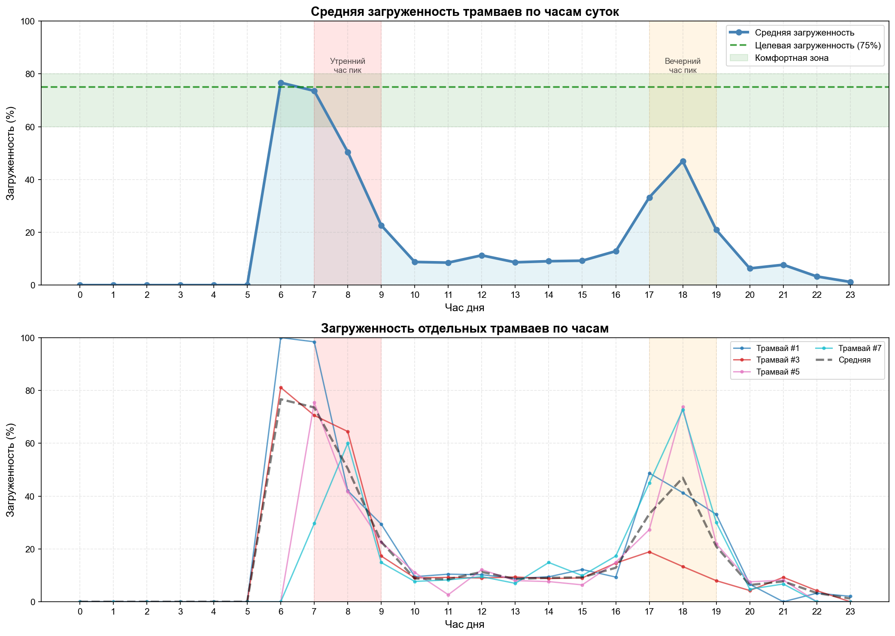
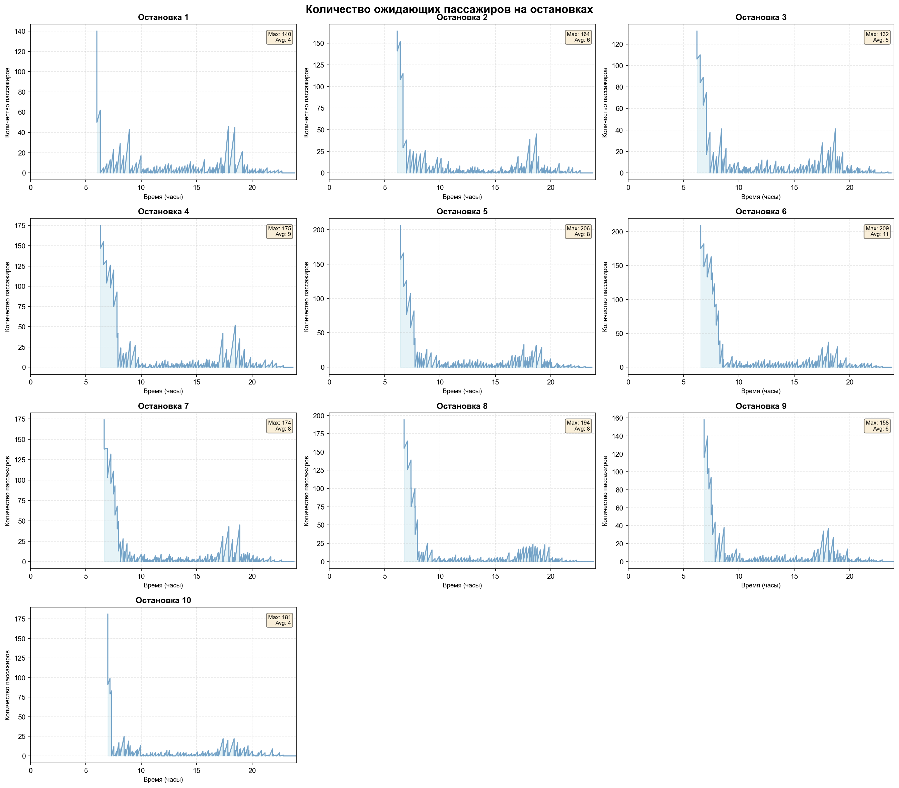
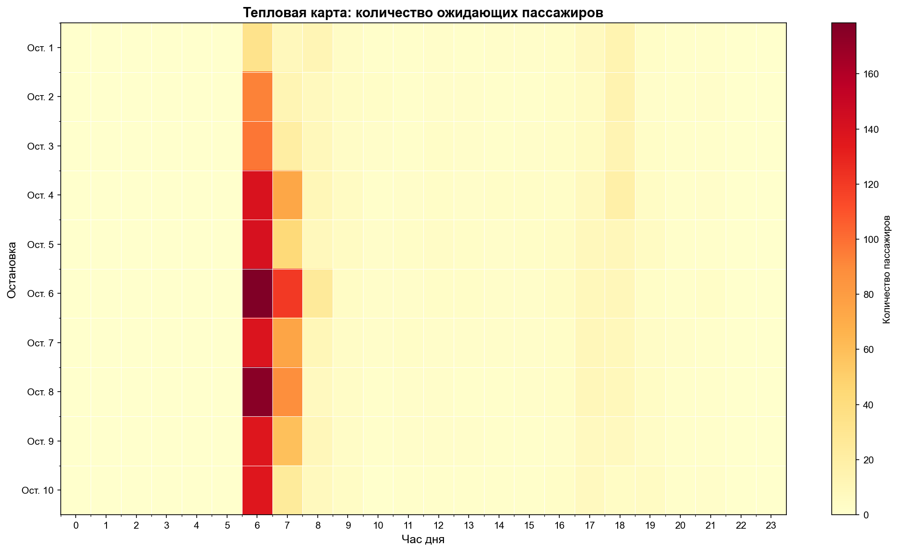
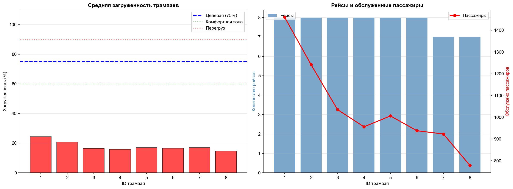
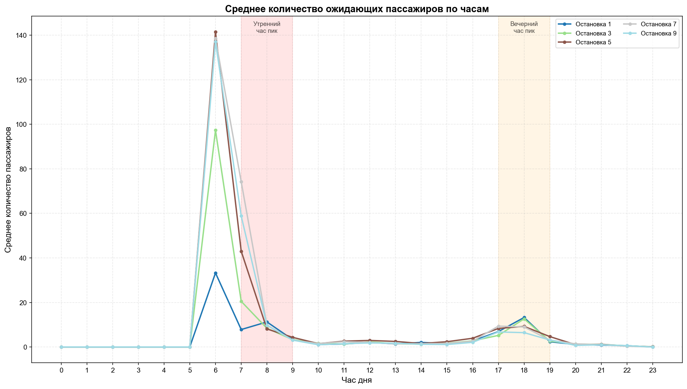

## СОДЕРЖАНИЕ

1. [Общее описание системы](#section1)
2. [Архитектура проекта](#section2)
3. [Логика работы модели](#section3)
4. [Модули и их функции](#section4)
5. [Формат входных данных](#section5)
6. [Результаты работы](#section6)
7. [Запуск и использование](#section7)
8. [Примеры работы модели](#section8)


***
<a name="section1"></a>
## 1. ОБЩЕЕ ОПИСАНИЕ СИСТЕМЫ

Разработанная система представляет собой дискретно-событийную имитационную модель для анализа работы трамвайного маршрута. Модель построена на базе библиотеки SimPy, которая позволяет эффективно моделировать параллельные процессы с общими ресурсами.

### Основные задачи модели:

- Моделирование движения трамваев по заданному маршруту с учётом графика движения
- Симуляция пассажиропотока с учётом времени суток и популярности остановок
- Расчёт ключевых показателей эффективности (загруженность, время ожидания, пропускная способность)
- Визуализация результатов для анализа узких мест системы

Модель позволяет тестировать различные конфигурации расписания и парка транспортных средств без проведения дорогостоящих натурных экспериментов.

***
<a name="section2"></a>
## 2. АРХИТЕКТУРА ПРОЕКТА

### Структура файлов:

```
project/
├── tram_simulation.py       # Ядро симуляции
├── visualization.py          # Построение графиков
├── logger.py                 # Система логирования
├── generate_config.py        # Генератор тестовых конфигураций
├── configs/                  # Конфигурационные файлы
└── outputs/                  # Результаты запусков
    └── run_YYYY-MM-DD_HH-MM-SS/
        ├── logs/             # CSV-файлы с детализацией
        └── plots/            # Графики результатов
```

***
<a name="section3"></a>
## 3. ЛОГИКА РАБОТЫ МОДЕЛИ

### 3.1 Инициализация системы

При запуске модели происходит:

1. Загрузка конфигурации из JSON-файла (параметры маршрута, интенсивности, расписание)
2. Создание остановок как точек с накапливающимися очередями
3. Формирование парка трамваев фиксированного размера
4. Помещение всех трамваев в пул доступных ресурсов

Используется паттерн "пул объектов" для эффективного переиспользования трамваев. Используется принцип FIFO - вернувшийся в парк трамвай встаёт в конец очереди на повторный выход.

### 3.2 Генерация пассажиров

Количество прибывающих пассажиров рассчитывается на основе:

- **Базовой интенсивности остановки** — зависит от положения на маршруте (центральные остановки загружены сильнее)
- **Коэффициента времени суток** — учитывает часы пик и ночное время
- **Времени с последнего трамвая** — чем дольше не было трамвая, тем больше накопилось пассажиров

Для имитации случайности применяется нормальное распределение как аппроксимация распределения Пуассона для больших интенсивностей.

**Формула:**

```
новых_пассажиров = N(μ=интенсивность×Δt, σ=√μ)
где N — нормальное распределение
```


### 3.3 Жизненный цикл трамвая

Каждый трамвай проходит следующий цикл:

1. **Ожидание** — находится в пуле до момента выхода на маршрут
2. **Выход на маршрут** — запускается согласно расписанию (bus_interval)
3. **Движение "туда"** — последовательный проезд всех остановок (1→N)
4. **Разворот** — пауза на конечной остановке
5. **Движение "обратно"** — проезд остановок в обратном порядке (N→1)
6. **Возврат на базу** — трамвай освобождается и возвращается в пул
7. **Повторное использование** — может быть запущен снова при необходимости

Один полный цикл (туда+обратно) считается одним рейсом.

### 3.4 Логика остановки

При прибытии трамвая на остановку:

1. **Высадка пассажиров:**
    - Базовый процент высадки (20%)
    - Удвоение на популярной остановке (центр города)
    - Увеличение по мере приближения к концу маршрута
    - Полная высадка на конечной остановке
2. **Генерация новых пассажиров:**
    - Расчёт количества на основе интенсивности и времени ожидания
3. **Посадка:**
    - Садится min(ожидающих, свободных_мест)
    - Оставшиеся продолжают ждать следующего трамвая
4. **Учёт времени:**
    - Фиксируется время ожидания для расчёта средних показателей
    - Обновляется время последнего обслуживания остановки

### 3.5 Расчёт времени движения

Время проезда между остановками зависит от:

- Расстояния (из конфигурации)
- Базовой скорости потока (flow_speed)
- Загруженности дорог в текущий час (road_loads)
- Случайного отклонения ±5% (имитация светофоров, маневрирования)

**Формула:**

```
скорость = базовая_скорость × (1 - загруженность) × случайность
время = расстояние / скорость + время_разгона
```

В часы пик (загруженность 0.9) скорость падает до 10% от номинальной, что реалистично отражает пробки.

***
<a name="section4"></a>
## 4. МОДУЛИ И ИХ ФУНКЦИИ

### 4.1 tram_simulation.py

**Основные классы:**

- `Stop` — модель остановки с очередью пассажиров
    - `get_new_passengers()` — генерация прибывших пассажиров
    - `record_waiting()` — запись состояния для построения графиков
- `Tram` — модель трамвая
    - `board_passengers()` — посадка с учётом вместимости
    - `alight_passengers()` — высадка по сложной логике
    - `log_stop_event()` — детальное логирование для CSV
- `TramSimulation` — управляющий класс
    - `tram_generator()` — процесс выпуска трамваев по расписанию
    - `tram_process()` — жизненный цикл одного трамвая
    - `arrive_at_stop()` — обработка прибытия на остановку
    - `calculate_travel_time()` — расчёт времени в пути


### 4.2 visualization.py

Модуль построения аналитических графиков:

- `plot_waiting_passengers()` — динамика очередей на каждой остановке
- `plot_waiting_by_hour()` — среднее количество ожидающих по часам
- `plot_heatmap()` — тепловая карта загруженности остановок
- `plot_utilization()` — загруженность трамваев
- `plot_tram_utilization_by_hour()` — почасовая загруженность парка

Графики сохраняются в PNG с разрешением 150 DPI.

### 4.3 logger.py

Система детального логирования:

- Создаёт отдельный CSV для каждого трамвая с полной историей остановок
- Формирует сводную таблицу по всем трамваям
- Записывает: время, остановку, направление, высадку, посадку, загруженность


### 4.4 generate_config.py

Генератор тестовых конфигураций:

- `generate_intensity_data()` — интенсивность с учётом позиции остановки и времени суток
- `generate_bus_intervals()` — расписание с частыми интервалами в часы пик
- `generate_road_loads()` — загруженность дорог по шаблону будних дней
- `generate_distances()` — случайные расстояния между остановками (400-800м)

Функции позволяют быстро создавать тестовые сценарии без ручного заполнения JSON.

***
<a name="section5"></a>
## 5. ФОРМАТ ВХОДНЫХ ДАННЫХ

### JSON-конфигурация (пример: configs/tram_config.json)

```json
{
  "stop_number": 10,
  "distance": [[1,0], [2,500], [3,600], ...],
  "intensity": [
    [1,0,15], [1,1,15], [1,7,225], [1,8,270], ...,
    [2,0,13], [2,1,13], ...
  ],
  "bus_interval": [[6,18], [8,8], [10,15], [17,8], [20,20], [22,30]],
  "road_loads": [[0,0.1], [8,0.9], [17,0.9], ...],
  "flow_speed": 40,
  "peak_stop": 5,
  "tram_capacity": 120,
  "operation_start_hour": 6,
  "operation_end_hour": 24,
  "simulation_hours": 24,
  "acceleration_time": 0.5,
  "stop_time": 1.0
}
```


### Описание полей:

| Параметр | Тип | Описание |
| :-- | :-- | :-- |
| `stop_number` | Integer | Количество остановок на маршруте |
| `distance` | Array | [[номер_остановки, метров_от_предыдущей], ...] |
| `intensity` | Array | [[остановка, час, пассажиров_в_час], ...] — интенсивность прибытия пассажиров |
| `bus_interval` | Array | [[час_начала, минут_между_трамваями], ...] — расписание выхода трамваев |
| `road_loads` | Array | [[час, коэффициент_загруженности_0-1], ...] — влияние на скорость движения |
| `flow_speed` | Integer | Базовая скорость движения (км/ч) при отсутствии загруженности |
| `peak_stop` | Integer | Номер самой популярной остановки (обычно центр маршрута) |
| `tram_capacity` | Integer | Вместимость одного трамвая (количество мест) |
| `operation_start_hour` | Integer | **Час начала работы трамваев** (0-23), например 6 = 6:00 |
| `operation_end_hour` | Integer | **Час окончания работы трамваев** (0-24), например 24 = 0:00 следующего дня |
| `simulation_hours` | Integer | Длительность моделирования (часы), обычно 24 для суточного цикла |
| `acceleration_time` | Float | Время разгона/торможения на остановке (минуты) |
| `stop_time` | Float | Базовое время стоянки на остановке (минуты) |

### Важные замечания:

**1. Режим работы транспорта:**

- `operation_start_hour` и `operation_end_hour` определяют **рабочие часы** трамваев
- Пример: `"operation_start_hour": 6, "operation_end_hour": 24"` означает работу с 6:00 до 0:00 (18 часов)
- Вне рабочих часов трамваи **не выходят** на маршрут, но пассажиры **накапливаются** на остановках

**2. Длительность симуляции:**

- `simulation_hours` определяет полную длительность моделирования (обычно 24 часа для суточного цикла)
- Может быть больше рабочих часов — например, симуляция 24 часа при работе трамваев 18 часов

**3. Интенсивность пассажиров:**

- Задаётся для **всех 24 часов** (включая ночное время)
- Ночная интенсивность может быть ненулевой — пассажиры копятся к утру

**4. Расписание выхода трамваев:**

- Первая запись в `bus_interval` должна соответствовать `operation_start_hour` или быть близкой к нему
- Последняя запись определяет интервал перед окончанием работы
- Пример: `[[^2], , ...]` — с 6:00 интервал 18 минут, с 8:00 интервал 8 минут

***
<a name="section6"></a>
## 6. РЕЗУЛЬТАТЫ РАБОТЫ

### 6.1 Консольный вывод

- Лог событий в реальном времени (выход/возврат трамваев)
- Итоговая статистика по трамваям (рейсы, обслужено, средняя загрузка)
- Статистика по остановкам (обслужено, среднее ожидание, очередь)


### 6.2 CSV-файлы (outputs/run_*/logs/)

Для каждого трамвая создаётся файл `tram_XXX.csv`:


| Время (мин) | Час | Остановка | Направление | Ожидало | Высадка | Посадка | Загруженность (%) |
| :-- | :-- | :-- | :-- | :-- | :-- | :-- | :-- |
| 15.3 | 0 | 2 | Туда | 8 | 0 | 8 | 12.5 |

Сводная таблица `trams_summary.csv` содержит агрегированные показатели.

### 6.3 Графики (outputs/run_*/plots/)

1. **waiting_passengers.png** — графики (по остановкам) динамики очередей
2. **waiting_by_hour.png** — среднее количество ожидающих по часам
3. **waiting_heatmap.png** — матрица (остановки × часы) с цветовой индикацией
4. **tram_utilization.png** — загруженность каждого трамвая + количество рейсов
5. **tram_utilization_by_hour.png** — почасовая динамика загруженности парка

***
<a name="section7"></a>
## 7. ЗАПУСК И ИСПОЛЬЗОВАНИЕ {\#использование}

### 7.1 Установка зависимостей

```bash
pip install -r requirements.txt
```


### 7.2 Генерация конфигураций

```bash
python generate_config.py
```

Создаст в папке `configs/` три тестовых конфигурации.

### 7.3 Запуск симуляции

**Базовый запуск:**

```bash
python tram_simulation.py
```

**С указанием конфигурации:**

```bash
python tram_simulation.py --config tram_config_large.json
```

**Без графиков (быстрый режим):**

```bash
python tram_simulation.py --no-plots
```

**Без детальных логов:**

```bash
python tram_simulation.py --no-logs
```


### 7.4 Анализ результатов

Результаты сохраняются в `outputs/run_ГГГГ-ММ-ДД_ЧЧ-ММ-СС/`. Каждый запуск создаёт отдельную папку с timestamp, что позволяет сравнивать различные конфигурации.

***
<a name="section8"></a>
## 8. ПРИМЕР ВЫВОДА

### 8.1 Консольный вывод
```
Результаты будут сохранены в: outputs\run_2025-10-22_11-51-38/

============================================================
Запуск симуляции движения трамваев
Конфигурация: tram_config.json
Длительность: 24 часов
Количество остановок: 10
Вместимость трамвая: 90 чел.
============================================================

Создан парк из 8 трамваев
[360.0] Трамвай #1 выехал на маршрут (рейс #1)
[378.0] Трамвай #2 выехал на маршрут (рейс #1)
[396.0] Трамвай #3 выехал на маршрут (рейс #1)
[414.0] Трамвай #4 выехал на маршрут (рейс #1)
[432.0] Трамвай #5 выехал на маршрут (рейс #1)
[450.0] Трамвай #6 выехал на маршрут (рейс #1)
[468.0] Трамвай #7 выехал на маршрут (рейс #1)
[486.0] Трамвай #8 выехал на маршрут (рейс #1)
[509.9] Трамвай #1 вернулся на базу. Рейс #1, обслужено 712 пас. (всего)
[509.9] Трамвай #1 выехал на маршрут (рейс #2)
[540.9] Трамвай #2 вернулся на базу. Рейс #1, обслужено 678 пас. (всего)
[540.9] Трамвай #2 выехал на маршрут (рейс #2)
[556.4] Трамвай #3 вернулся на базу. Рейс #1, обслужено 546 пас. (всего)
[556.4] Трамвай #3 выехал на маршрут (рейс #2)
[576.0] Трамвай #4 вернулся на базу. Рейс #1, обслужено 437 пас. (всего)
[576.0] Трамвай #4 выехал на маршрут (рейс #2)
[601.1] Трамвай #5 вернулся на базу. Рейс #1, обслужено 395 пас. (всего)
[601.1] Трамвай #5 выехал на маршрут (рейс #2)
[612.0] Трамвай #6 вернулся на базу. Рейс #1, обслужено 339 пас. (всего)
[612.0] Трамвай #6 выехал на маршрут (рейс #2)
[621.4] Трамвай #7 вернулся на базу. Рейс #1, обслужено 220 пас. (всего)
[627.0] Трамвай #7 выехал на маршрут (рейс #2)
[628.6] Трамвай #8 вернулся на базу. Рейс #1, обслужено 171 пас. (всего)
[638.3] Трамвай #1 вернулся на базу. Рейс #2, обслужено 851 пас. (всего)
[642.0] Трамвай #8 выехал на маршрут (рейс #2)
[653.2] Трамвай #2 вернулся на базу. Рейс #2, обслужено 760 пас. (всего)
[657.0] Трамвай #1 выехал на маршрут (рейс #3)
[662.5] Трамвай #3 вернулся на базу. Рейс #2, обслужено 627 пас. (всего)
[671.4] Трамвай #4 вернулся на базу. Рейс #2, обслужено 519 пас. (всего)
[672.0] Трамвай #2 выехал на маршрут (рейс #3)
[677.7] Трамвай #5 вернулся на базу. Рейс #2, обслужено 444 пас. (всего)
[686.5] Трамвай #6 вернулся на базу. Рейс #2, обслужено 382 пас. (всего)
[687.0] Трамвай #3 выехал на маршрут (рейс #3)
[702.0] Трамвай #4 выехал на маршрут (рейс #3)
[703.6] Трамвай #7 вернулся на базу. Рейс #2, обслужено 277 пас. (всего)
[717.0] Трамвай #5 выехал на маршрут (рейс #3)
[718.8] Трамвай #8 вернулся на базу. Рейс #2, обслужено 237 пас. (всего)
[732.0] Трамвай #6 выехал на маршрут (рейс #3)
[735.6] Трамвай #1 вернулся на базу. Рейс #3, обслужено 931 пас. (всего)
[747.0] Трамвай #7 выехал на маршрут (рейс #3)
[748.7] Трамвай #2 вернулся на базу. Рейс #3, обслужено 822 пас. (всего)
[762.0] Трамвай #8 выехал на маршрут (рейс #3)
[764.3] Трамвай #3 вернулся на базу. Рейс #3, обслужено 699 пас. (всего)
[777.0] Трамвай #1 выехал на маршрут (рейс #4)
[781.7] Трамвай #4 вернулся на базу. Рейс #3, обслужено 608 пас. (всего)
[792.0] Трамвай #2 выехал на маршрут (рейс #4)
[795.3] Трамвай #5 вернулся на базу. Рейс #3, обслужено 526 пас. (всего)
[807.0] Трамвай #3 выехал на маршрут (рейс #4)
[810.4] Трамвай #6 вернулся на базу. Рейс #3, обслужено 456 пас. (всего)
[822.0] Трамвай #4 выехал на маршрут (рейс #4)
[823.2] Трамвай #7 вернулся на базу. Рейс #3, обслужено 338 пас. (всего)
[837.0] Трамвай #5 выехал на маршрут (рейс #4)
[840.6] Трамвай #8 вернулся на базу. Рейс #3, обслужено 315 пас. (всего)
[852.0] Трамвай #6 выехал на маршрут (рейс #4)
[853.5] Трамвай #1 вернулся на базу. Рейс #4, обслужено 997 пас. (всего)
[867.0] Трамвай #7 выехал на маршрут (рейс #4)
[869.4] Трамвай #2 вернулся на базу. Рейс #4, обслужено 896 пас. (всего)
[882.0] Трамвай #8 выехал на маршрут (рейс #4)
[884.2] Трамвай #3 вернулся на базу. Рейс #4, обслужено 765 пас. (всего)
[897.0] Трамвай #1 выехал на маршрут (рейс #5)
[897.3] Трамвай #4 вернулся на базу. Рейс #4, обслужено 657 пас. (всего)
[912.0] Трамвай #2 выехал на маршрут (рейс #5)
[912.5] Трамвай #5 вернулся на базу. Рейс #4, обслужено 580 пас. (всего)
[927.0] Трамвай #6 вернулся на базу. Рейс #4, обслужено 506 пас. (всего)
[927.0] Трамвай #3 выехал на маршрут (рейс #5)
[942.0] Трамвай #4 выехал на маршрут (рейс #5)
[945.6] Трамвай #7 вернулся на базу. Рейс #4, обслужено 420 пас. (всего)
[957.0] Трамвай #5 выехал на маршрут (рейс #5)
[958.9] Трамвай #8 вернулся на базу. Рейс #4, обслужено 383 пас. (всего)
[972.0] Трамвай #6 выехал на маршрут (рейс #5)
[978.6] Трамвай #1 вернулся на базу. Рейс #5, обслужено 1076 пас. (всего)
[987.0] Трамвай #7 выехал на маршрут (рейс #5)
[994.6] Трамвай #2 вернулся на базу. Рейс #5, обслужено 966 пас. (всего)
[1002.0] Трамвай #8 выехал на маршрут (рейс #5)
[1014.4] Трамвай #3 вернулся на базу. Рейс #5, обслужено 865 пас. (всего)
[1017.0] Трамвай #1 выехал на маршрут (рейс #6)
[1032.0] Трамвай #2 выехал на маршрут (рейс #6)
[1040.0] Трамвай #3 выехал на маршрут (рейс #6)
[1040.8] Трамвай #4 вернулся на базу. Рейс #5, обслужено 752 пас. (всего)
[1048.0] Трамвай #4 выехал на маршрут (рейс #6)
[1075.8] Трамвай #5 вернулся на базу. Рейс #5, обслужено 734 пас. (всего)
[1075.8] Трамвай #5 выехал на маршрут (рейс #6)
[1111.4] Трамвай #6 вернулся на базу. Рейс #5, обслужено 717 пас. (всего)
[1111.4] Трамвай #6 выехал на маршрут (рейс #6)
[1151.8] Трамвай #7 вернулся на базу. Рейс #5, обслужено 772 пас. (всего)
[1151.8] Трамвай #7 выехал на маршрут (рейс #6)
[1161.1] Трамвай #8 вернулся на базу. Рейс #5, обслужено 681 пас. (всего)
[1161.1] Трамвай #8 выехал на маршрут (рейс #6)
[1177.7] Трамвай #2 вернулся на базу. Рейс #6, обслужено 1148 пас. (всего)
[1177.7] Трамвай #2 выехал на маршрут (рейс #7)
[1178.2] Трамвай #3 вернулся на базу. Рейс #6, обслужено 966 пас. (всего)
[1178.7] Трамвай #1 вернулся на базу. Рейс #6, обслужено 1406 пас. (всего)
[1185.7] Трамвай #3 выехал на маршрут (рейс #7)
[1189.3] Трамвай #4 вернулся на базу. Рейс #6, обслужено 912 пас. (всего)
[1193.7] Трамвай #1 выехал на маршрут (рейс #7)
[1201.7] Трамвай #4 выехал на маршрут (рейс #7)
[1208.3] Трамвай #5 вернулся на базу. Рейс #6, обслужено 952 пас. (всего)
[1221.0] Трамвай #6 вернулся на базу. Рейс #6, обслужено 900 пас. (всего)
[1221.7] Трамвай #5 выехал на маршрут (рейс #7)
[1234.6] Трамвай #7 вернулся на базу. Рейс #6, обслужено 877 пас. (всего)
[1234.8] Трамвай #8 вернулся на базу. Рейс #6, обслужено 726 пас. (всего)
[1241.7] Трамвай #6 выехал на маршрут (рейс #7)
[1250.4] Трамвай #3 вернулся на базу. Рейс #7, обслужено 996 пас. (всего)
[1251.0] Трамвай #2 вернулся на базу. Рейс #7, обслужено 1222 пас. (всего)
[1257.0] Трамвай #1 вернулся на базу. Рейс #7, обслужено 1447 пас. (всего)
[1261.7] Трамвай #7 выехал на маршрут (рейс #7)
[1263.5] Трамвай #4 вернулся на базу. Рейс #7, обслужено 954 пас. (всего)
[1281.7] Трамвай #8 выехал на маршрут (рейс #7)
[1284.4] Трамвай #5 вернулся на базу. Рейс #7, обслужено 1006 пас. (всего)
[1301.7] Трамвай #3 выехал на маршрут (рейс #8)
[1303.0] Трамвай #6 вернулся на базу. Рейс #7, обслужено 938 пас. (всего)
[1321.7] Трамвай #2 выехал на маршрут (рейс #8)
[1323.7] Трамвай #7 вернулся на базу. Рейс #7, обслужено 923 пас. (всего)
[1341.7] Трамвай #1 выехал на маршрут (рейс #8)
[1344.3] Трамвай #8 вернулся на базу. Рейс #7, обслужено 779 пас. (всего)
[1361.7] Трамвай #4 выехал на маршрут (рейс #8)
[1362.9] Трамвай #3 вернулся на базу. Рейс #8, обслужено 1035 пас. (всего)
[1381.1] Трамвай #2 вернулся на базу. Рейс #8, обслужено 1242 пас. (всего)
[1381.7] Трамвай #5 выехал на маршрут (рейс #8)
[1397.2] Трамвай #1 вернулся на базу. Рейс #8, обслужено 1460 пас. (всего)
[1411.7] Трамвай #6 выехал на маршрут (рейс #8)
[1413.6] Трамвай #4 вернулся на базу. Рейс #8, обслужено 956 пас. (всего)
[1430.0] Трамвай #5 вернулся на базу. Рейс #8, обслужено 1006 пас. (всего)

============================================================
РЕЗУЛЬТАТЫ СИМУЛЯЦИИ
============================================================
Время симуляции: 24 часов (1440.0 мин)

Общая статистика:
  • Всего обслужено пассажиров: 8339
  • Трамваев в парке: 8
  • Среднее отклонение загруженности от 75%: 59.47%

Статистика по трамваям:
  Трамвай #1: 1460 пас., 8 рейсов (туда-обратно), средняя загрузка 24.3%
  Трамвай #2: 1242 пас., 8 рейсов (туда-обратно), средняя загрузка 20.7%
  Трамвай #3: 1035 пас., 8 рейсов (туда-обратно), средняя загрузка 16.4%
  Трамвай #4: 956 пас., 8 рейсов (туда-обратно), средняя загрузка 15.7%
  Трамвай #5: 1006 пас., 8 рейсов (туда-обратно), средняя загрузка 16.9%
  Трамвай #6: 938 пас., 8 рейсов (туда-обратно), средняя загрузка 16.5%
  Трамвай #7: 923 пас., 7 рейсов (туда-обратно), средняя загрузка 17.0%
  Трамвай #8: 779 пас., 7 рейсов (туда-обратно), средняя загрузка 14.7%

Статистика по остановкам:
  Остановка  1: обслужено  768 пас., среднее ожидание  28.6 мин, осталось 0 в очереди
  Остановка  2: обслужено  821 пас., среднее ожидание  12.3 мин, осталось 0 в очереди
  Остановка  3: обслужено  791 пас., среднее ожидание  13.3 мин, осталось 0 в очереди
  Остановка  4: обслужено  913 пас., среднее ожидание  12.9 мин, осталось 0 в очереди
  Остановка  5: обслужено 1017 пас., среднее ожидание  15.7 мин, осталось 0 в очереди
  Остановка  6: обслужено  940 пас., среднее ожидание  13.3 мин, осталось 0 в очереди
  Остановка  7: обслужено  852 пас., среднее ожидание  14.9 мин, осталось 0 в очереди
  Остановка  8: обслужено  814 пас., среднее ожидание  15.6 мин, осталось 0 в очереди
  Остановка  9: обслужено  744 пас., среднее ожидание  18.4 мин, осталось 0 в очереди
  Остановка 10: обслужено  679 пас., среднее ожидание  33.2 мин, осталось 0 в очереди
============================================================
```
### 8.2 Графики
Все приведённые графики являются примером визуализации, поэтому конкретные цифры могут быть далеки от реальности
#### График 1: Загруженность трамваев по часам



#### График 2: Очереди на остановках



#### График 3: Тепловая карта загруженности



#### График 4: Загрузка и количество рейсов трамваев 


#### График 4: Среднее количество пассажиров, ожидающих по часам 

